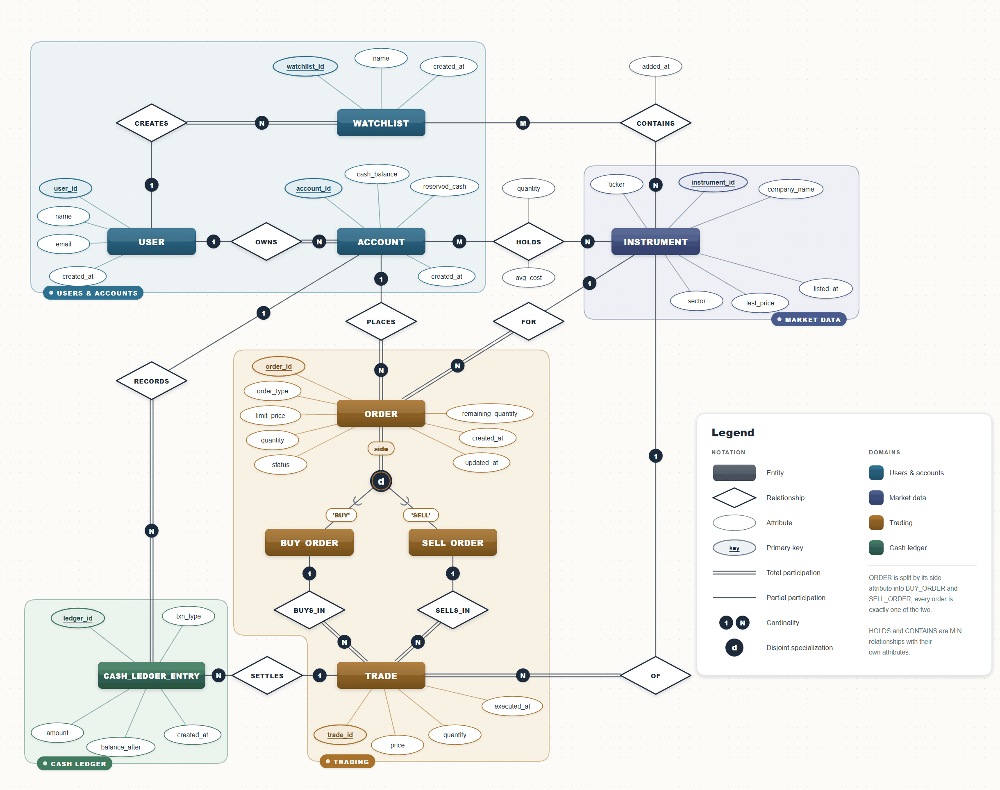

# Trading Simulator

DBMS course project, Group 19.

A simplified stock exchange. Users keep cash in trading accounts and place buy and sell limit
orders on 15 listed companies. Orders are matched by price-time priority, with partial fills.

All the important logic is in PostgreSQL: the matching, the cash and share transfers, and the
business rules are written as functions, procedures, triggers and constraints. The Express
backend and React frontend just pass requests to the database and show what it returns.

**Documents:** [Database design (PDF)](docs/design_doc.pdf) · [Application design (PDF)](docs/application_design.pdf)

<p align="center">
  
</p>

---

## Team

| Name | BITS ID |
|---|---|
| Prateek Thota | 2024AAPS0254H |
| Aditya Sanadhaya | 2024AAPS0263H |
| Shreyas Khunteta | 2024AAPS0302H |
| Muhilan Selvakumar | 2024AAPS0309H |

## Tech stack

| Part | Used |
|---|---|
| Database | PostgreSQL (hosted on Neon) |
| Backend | Node.js, Express, `pg` (plain SQL, no ORM) |
| Frontend | React, Vite |

## Project structure

```
backend/     Express API (routes in src/routes/) and the database setup script
frontend/    React app (one component per screen in src/components/)
db/          all the SQL: tables, seed data, views, triggers, procedures, indexes, queries
docs/        design documents and the EER diagram
```

## Setup and run

You need Node.js and a PostgreSQL database (we used Neon).

**1. Environment.** Copy `.env.example` to `.env` in the repo root and fill in:
- `DATABASE_URL` - direct connection, used by the setup script
- `DATABASE_URL_POOLED` - used by the backend (on a local database both can be the same)

**2. Build the database.** This **deletes everything** in that database and then runs the
files in `db/` in this order: reset, schema, seed, views, triggers, matching_engine, funds, indexes.

```bash
cd backend
npm install
npm run db:setup -- --yes
```

It should end with `total rows: 1316`. The seed is fixed, so every rebuild gives the same data.

**3. Start the backend** (port 4000):

```bash
cd backend
npm start
```

**4. Start the frontend** (port 5173), then open http://localhost:5173:

```bash
cd frontend
npm install
npm run dev
```

There is no login. Type an account id (1 to 63) in the header to use that account.

## Workflows

| # | Workflow | Where | What happens |
|---|---|---|---|
| 1 | Place an order | Trade | `place_order` checks and reserves the cash or shares, matches against the book, and for each fill writes the trade, moves cash and shares and adds two ledger rows, all in one transaction. |
| 2 | Cancel an order | Trade | `cancel_order` marks the order cancelled and releases the cash still reserved for it. Only the owner can cancel, and only open orders. |
| 3 | Rejected actions | any | Ordering more than your free cash or shares, withdrawing reserved cash, adding a duplicate to a watchlist or editing a trade are refused by the database, and its message is shown. |
| 4 | Search the market | Markets | Search by ticker or company name and filter by sector. Shows best bid, best ask and 30-day volume. |
| 5 | Portfolio, history, reports | Portfolio, History, Reports | Holdings and profit/loss come from views. Reports runs queries 2, 3, 5 and 6 straight from `db/queries.sql`. |
| 6 | Deposit and withdraw | Funds | `deposit_cash` and `withdraw_cash` update the balance and the cash statement together. Only free cash can be withdrawn. |
| 7 | Watchlists | Watchlists | Create and delete named lists, add and remove instruments. |

## Database objects

| Kind | Name | File |
|---|---|---|
| Tables (9) | `users`, `accounts`, `instruments`, `orders`, `trades`, `holdings`, `cash_ledger`, `watchlists`, `watchlist_items` | `db/schema.sql` |
| Views | `v_order_book`, `v_portfolio`, `v_account_summary` (built on `v_portfolio`), `v_price_history` | `db/views.sql` |
| Triggers | set `orders.updated_at`; update `instruments.last_price` after a trade; block UPDATE/DELETE on `trades` and `cash_ledger` | `db/triggers.sql` |
| Function | `compute_fill_plan` (CTE with a running-total window function) | `db/matching_engine.sql` |
| Procedures | `place_order`, `cancel_order` | `db/matching_engine.sql` |
| Procedures | `deposit_cash`, `withdraw_cash` | `db/funds.sql` |
| Indexes | `idx_orders_book` (partial), `idx_orders_account`, `idx_trades_buy_order`, `idx_trades_sell_order`, `idx_trades_instrument`, `idx_cash_ledger_account` | `db/indexes.sql` |
| Seed data | 1,316 rows across all tables | `db/seed.sql` |
| Reset | drops everything for a clean rebuild | `db/reset.sql` |

### Queries (`db/queries.sql`)

| # | Query | Uses |
|---|---|---|
| 1 | Order book depth for one instrument | aggregation, GROUP BY |
| 2 | Portfolio value and unrealised P&L per account | four-table join, aggregation |
| 3 | Instruments trading above their 30-day average | correlated subquery |
| 4 | Trade history of one account | joining `orders` twice |
| 5 | Top 5 accounts by trade value in 30 days | CTE, UNION ALL, RANK() |
| 6 | Users who never placed an order | NOT EXISTS |

## API routes

All routes start with `/api`.

| Method | Route | Uses |
|---|---|---|
| GET | `/instruments?search=&sector=` | `instruments`, `v_order_book`, `trades` |
| GET | `/instruments/sectors` | `instruments` |
| GET | `/instruments/:id/book` | `v_order_book` |
| GET | `/instruments/:id/history` | `v_price_history` |
| GET | `/accounts/:id/summary` | `v_account_summary` |
| GET | `/accounts/:id/portfolio` | `v_portfolio` |
| GET | `/accounts/:id/trades` | query 4 |
| GET | `/accounts/:id/ledger` | `cash_ledger` |
| GET | `/accounts/:id/orders` | `orders` |
| POST | `/accounts/:id/deposit`, `/accounts/:id/withdraw` | `deposit_cash`, `withdraw_cash` |
| GET, POST | `/accounts/:id/watchlists` | `watchlists` |
| DELETE | `/accounts/:id/watchlists/:watchlistId` | `watchlists` |
| GET, POST | `/accounts/:id/watchlists/:watchlistId/items` | `watchlist_items` |
| DELETE | `/accounts/:id/watchlists/:watchlistId/items/:instrumentId` | `watchlist_items` |
| POST | `/orders` | `place_order` |
| POST | `/orders/:id/cancel` | `cancel_order` |
| GET | `/orders/:id` | `orders`, `trades` |
| GET | `/reports/:name` | queries 2, 3, 5, 6 |

## Contributions

| Member | Part | Covers |
|---|---|---|
| Prateek Thota | Matching engine and transactions | `db/matching_engine.sql` (`compute_fill_plan`, `place_order`, `cancel_order`), `db/funds.sql`, locking and concurrency |
| Muhilan Selvakumar | Database design and schema | EER diagram, `db/schema.sql` (tables, keys, constraints), normalization |
| Aditya Sanadhaya | Queries, views and indexes | `db/queries.sql`, `db/views.sql`, `db/indexes.sql` |
| Shreyas Khunteta | Application and integration | `backend/`, `frontend/`, `db/triggers.sql`, `db/seed.sql`, the demo workflows |
